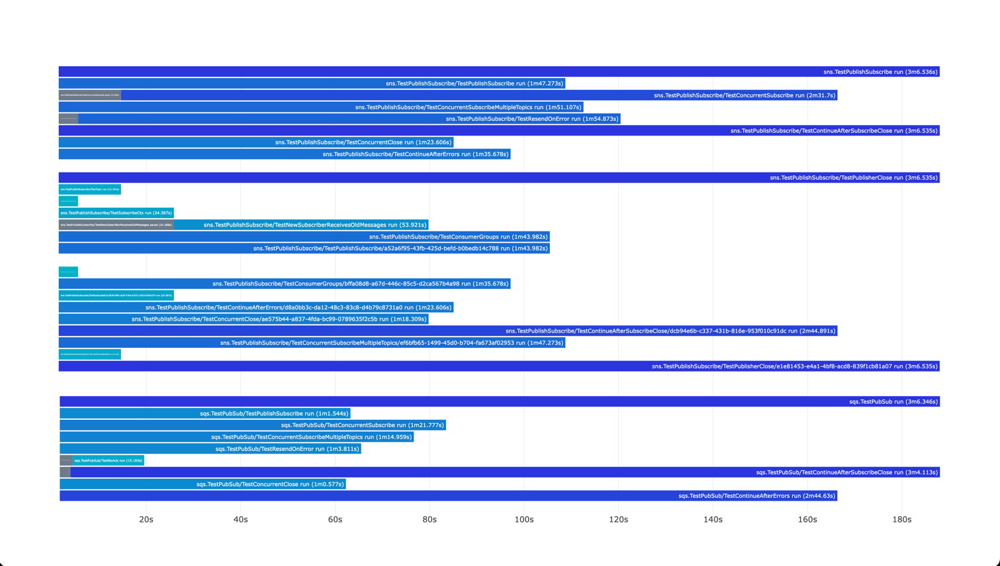
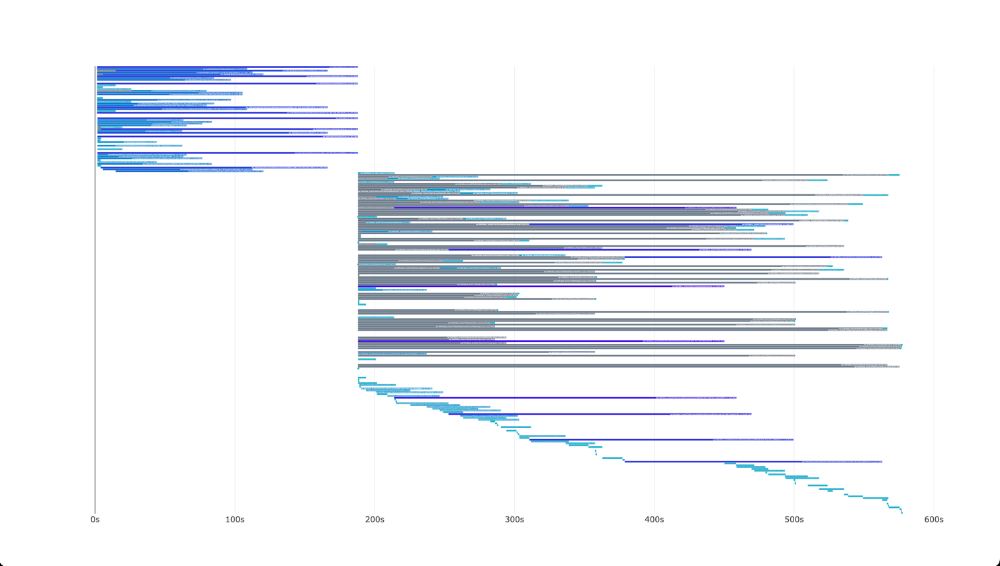

# vgt - Visualise Go Test


`vgt` is a tool for visualising Go test results in a browser.

It's helpful with understanding parallelism of tests and identifying slow tests.
More information can be found in the [TODO] blog post.




## Installation

```bash
go install -u github.com/roblaszczak/vgt
```

You can also run without installing by running `go run github.com/roblaszczak/vgt@latest`.

## Usage

For visualising test results, run `go test` with the `-json` flag and pipe the output to `vgt`.

```bash
go test -json ./... | vgt
```

or with `go run`:

```bash
go test -json ./... | go run github.com/roblaszczak/vgt@latest
```

> [!WARNING]  
> When you are piping go tests output to `vgt`, `vgt` will exit with 1 when tests failed.

or just `vgt` with a custom flags after `--` to run tests and visualise them:

```bash
$ vgt -- ./... -count=1 -short
10:26PM INF Running go test command="[go test -json ./... -count=1 -short]"
```

After tests were executed, a browser window will open with the visualisation.

If you want to preserve the output, you can pipe test logs to file and later pass it to `vgt`:

```bash
go test -json ./... > test.json
cat test.json | vgt
```

### Additional flags

```bash
Usage of vgt:
  -debug
    	enable debug mode
  -dont-pass-output
    	don't print output received to stdin
  -duration-cutoff string
    	threshold for test duration cutoff, under which tests are not shown in the chart (default "100µs")
  -from-file string
    	read input from file instead of stdin
  -keep-running
    	keep browser running after page was opened
  -print-html
    	print html to stdout instead of opening browser
```

## Development

If you have an idea for a feature or found a bug, feel free to open an issue or a pull request.

Before making a big change, it's a good idea to open an issue to discuss it first.

### Running tests

Tests are not really sophisticated, and are based on checking changes in golden files and checking in browser if
it looks good.

### Updating golden files

If you made a change and want to update golden files, you can run:

```bash
go test . -update-golden
```
